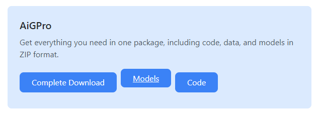

# AiGPro: A multi-tasks model for Profiling of GPCRs for Agonist and Antagonist

## Overview

G protein-coupled receptors (GPCRs) play vital roles in various physiological processes, making them attractive drug discovery targets. Meanwhile, deep learning techniques have revolutionized drug discovery by facilitating efficient tools for expediting the identification and optimization of ligands. However, existing models for the GPCRs often focus on single-target or a small subset of GPCRs or employ binary classification, constraining their applicability for high throughput virtual screening. To address these issues, we introduce AiGPro, a novel multitask model designed to predict small molecule agonist (EC50) and antagonist (IC50) across the 231 human GPCRs, making it a first-in-class solution for large-scale GPCR profiling. 
Leveraging multi-scale context aggregation and bidirectional multi-head cross-attention mechanisms, our ap-proach demonstrates that ensemble models may not be necessary for predicting complex GPCR states and small molecule interactions. Through extensive validation using stratified 10-fold cross-validation, AiGPro achieves robust performance with Pearson's correlation coefficient 0.91, indicating broad generalizability. This break-through sets a new standard in the GPCR studies, outperforming previous studies. Moreover, our first-in-class multi-tasking model can predict agonist and antagonist activities across a wide range of GPCRs, offering a comprehensive perspective on ligand bioactivity within this diverse superfamily. 

To make AiGPro easily accessible, we have deployed a web-based platform for public use at [AiGPro Web Platform](https://aicadd.ssu.ac.kr/AiGPro).

## Key Features

- **Comprehensive Coverage:** Predicts both agonist and antagonist activities across 231 human GPCRs.
- **High Performance:** Achieves a Pearson's correlation coefficient of 0.91 through extensive validation.
- **Advanced Architecture:** Utilizes multi-scale context aggregation and bidirectional multi-head cross-attention mechanisms.
- **User-Friendly:** Accessible via a web-based platform, enabling seamless integration into drug discovery workflows.

## Requirements

- Docker
- Python
- Make

## Installation

### Using Docker

We recommend using Docker for a seamless setup across different systems. Follow the [Docker installation guide](https://docs.docker.com/engine/install/ubuntu/) for your appropriate operating system.

### Steps to Install AiGPro

1. **Download Model Weights:**

   Visit [AiGPro Model Weights](https://aicadd.ssu.ac.kr/download) and download the required model files and keep the name as ***'model_aigpro.pt'***.

   

2. **Prepare the Directory:**

   Place the downloaded model weights into the `reference` folder within the `aigpro` directory of the project.

3. **Run the Application:**

   Navigate to the root directory of the project in your terminal and execute the following command to start the application:
   
   ```bash
   make up
    ```
    or 

    ```
    docker compose up -d

    ```

4. **Use**

   Please follow the example given in the test_api notebook to use the model for predictions. 


    

